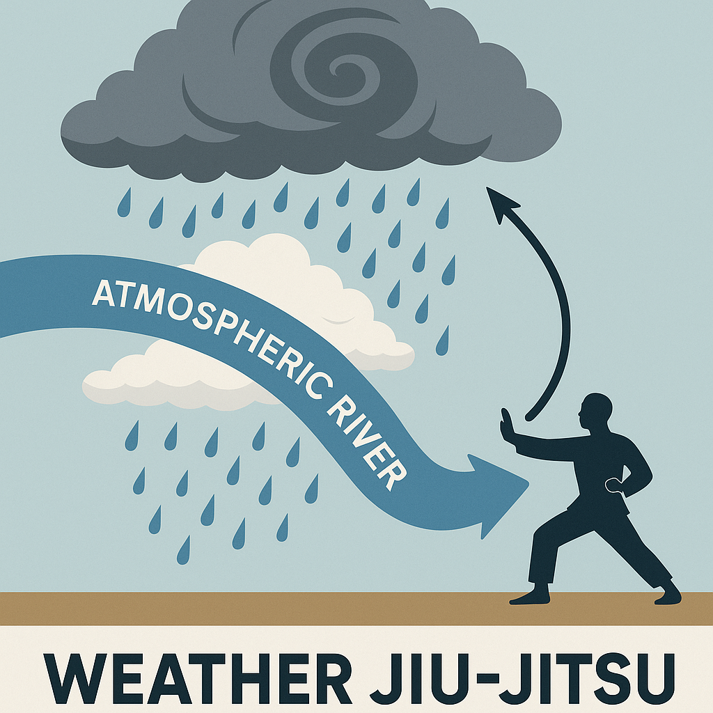

# TESTING 🌪️ Weather Jiu-Jitsu: Adaptive Control of Extreme Weather Events

<p align="center">
  
</p>

**Weather Jiu-Jitsu** is a novel research framework that explores how to *gently redirect or deflect* extreme weather — such as hurricanes and atmospheric rivers — through scientifically informed, low-energy interventions in the atmosphere.

> “Like martial arts for the atmosphere — using the system’s own chaotic energy against itself.”

---

## 📄 Featured Work

- 🔬 **[Nature Review Perspective (Preprint)](./papers/weatherjiujitsu-perspective.pdf)**  
  A new lens on climate adaptation: shifting from prediction to intervention.

- 📊 **[AGU Poster 2024](./papers/AGU-poster-dec2024.pdf)**  
  Key concepts, simulations, and early results from Lorenz-63 and Aurora model control experiments.

---

## 🎥 Visual Highlights


- 🌀 33-hour simulation shows typhoon track shifting 28 km using perturbations ~30° west
- 💡 Real-world potential for flood/drought mitigation via upstream flow control

---

## 🧠 What We Study

- Chaos control theory in atmospheric systems  
- Ensemble-based targeting for perturbation placement  
- Adaptive intervention for floods, hurricanes, atmospheric rivers  
- Applications in Earth system governance and climate adaptation policy

---

## 📚 How to Cite

Please cite the perspective paper if you use or build upon this work:

```bibtex
@article{lall2025weatherjiujitsu,
  author = {Lall, Upmanu and Liu, Moyan and QIN},
  title = {Weather Jiu-Jitsu: Adaptive Chaos Control for Climate Extremes},
  journal = {Nature Reviews Earth & Environment},
  year = {2025},
  note = {Preprint available at GitHub}
}
