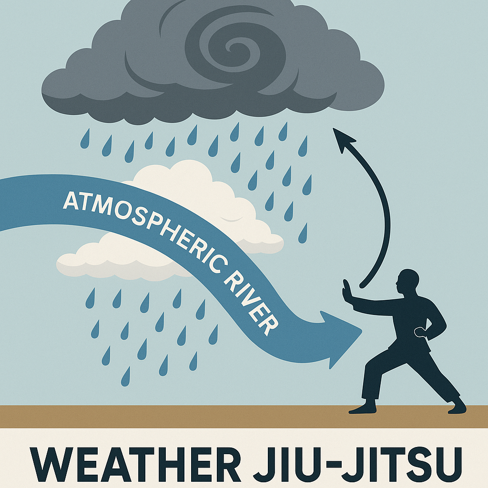

# Weather Jiu-Jitsu: Climate Adaptation for the 21st Century

<p align="center">
  
</p>

> "Like martial arts for the atmosphere — using the system's own chaotic energy against itself."

[](https://github.com/qhuang62/weatherjiujitsu)
[](./publication/wjj-perspective.pdf)
[](#)
[](#)

## 🌪️ Vision

**Weather Jiu-Jitsu** is a novel research framework that explores how to *gently redirect or deflect* extreme weather — such as hurricanes and atmospheric rivers — through scientifically informed, low-energy interventions in the atmosphere.

As extreme climate events intensify, traditional infrastructure and mitigation strategies are proving inadequate. We propose a paradigm shift: rather than building ever-higher seawalls or stronger buildings, we leverage the chaotic dynamics of weather systems to subtly redirect or weaken destructive events using precisely timed, small-energy interventions.

## 🧬 Core Concept

Weather systems are **chaotic** - highly sensitive to small changes in initial conditions. This sensitivity, traditionally viewed as limiting predictability, becomes our tool for control. By applying the right perturbation at the right place and time, we can potentially:

- **🌀 Steer hurricanes** away from populated coastlines
- **🌊 Redirect atmospheric rivers** to distribute precipitation safely
- **🔥 Break up heat domes** before they become deadly
- **❄️ Prevent extreme cold snaps** from overwhelming infrastructure
- **💨 Modify drought patterns** to restore water security

## 📚 Research Foundation

Our approach builds on three pillars:

### 1. **Chaos Theory** ([Learn More](./docs/theory/chaos-control.md))
- Edward Lorenz's foundational work on atmospheric dynamics
- Lorenz 63 & 84 models as testbeds for weather control
- Local Lyapunov exponents to identify intervention windows

### 2. **Deep Learning** ([Aurora Integration](./docs/implementations/aurora-integration.md))
- Foundation models like Aurora for accurate weather prediction
- Neural networks to identify optimal perturbation strategies
- Real-time adaptive control using machine learning

### 3. **Control Theory** ([Adaptive Methods](./docs/theory/adaptive-control.md))
- Model Predictive Control for multi-step optimization
- Ensemble forecasting for uncertainty quantification
- Robust control design for atmospheric disturbances

## 🎯 Target Applications

### Tropical Cyclones ([Details](./docs/applications/tropical-cyclones.md))
- **Strategy**: Modify upstream steering winds
- **Target**: Jet stream interactions at 200-300 hPa
- **Success Metric**: Track deviation >100 km from populated areas

### Atmospheric Rivers ([Details](./docs/applications/atmospheric-rivers.md))  
- **Strategy**: Deflect moisture corridors
- **Target**: Ridge-trough patterns steering ARs
- **Success Metric**: Precipitation redistribution to reduce flood risk

### Persistent Patterns ([Details](./docs/applications/blocking-patterns.md))
- **Strategy**: Break atmospheric blocking
- **Target**: Rossby wave amplitude and phase
- **Success Metric**: Reduce duration of heat waves/cold spells by 30-50%

## 📊 Current Research Status

### ✅ Completed
- [x] Theoretical framework development
- [x] Idealized model demonstrations (Lorenz systems)
- [x] Aurora foundation model integration
- [x] Proof-of-concept simulations

### 🔄 In Progress  
- [ ] Real-world case study analysis
- [ ] Perturbation mechanism development
- [ ] Environmental impact assessment
- [ ] International collaboration framework

### 🔮 Planned
- [ ] Field experiments with weather modification
- [ ] Operational control system deployment
- [ ] Global governance protocols
- [ ] Economic impact analysis

## 📖 Featured Publications

### 🔬 **Perspective Paper** ([PDF](./publication/wjj-perspective.pdf))
**"Weather Jiu-Jitsu: Climate Adaptation for the 21st Century"**  
*Qin Huang, Moyan Liu, Upmanu Lall*  
Submitted to Nature, July 2025

This foundational paper introduces the Weather Jiu-Jitsu concept, reviews traditional climate risk management approaches, and proposes adaptive chaos control as a novel 21st-century solution for extreme weather mitigation.

### ⚙️ **Control Methods** ([PDF](./publication/control-paper.pdf))
**"Adaptive Chaos Control of Weather Extremes: Demonstrating "Weather Jiu-Jitsu" in Idealized Models"**

Technical implementation of optimal control frameworks in Lorenz 63 and Lorenz 84 systems, demonstrating that small perturbations guided by Lyapunov exponents can maintain weather trajectories within safe boundaries.

### 📊 **Conference Presentations**
- **[AGU 2024 Poster](./publication/AGU-poster-2024.pdf)** - Adaptive chaos control for weather modification
- **[AGU 2025 Abstracts](./TIMELINE.md#agu-2025)** - Five presentations covering theory, modeling, and applications

## 🤝 How to Contribute

We invite collaboration from researchers across disciplines:

### For Researchers
- **Atmospheric Scientists**: Help refine targeting strategies
- **Control Engineers**: Improve adaptive algorithms  
- **Computer Scientists**: Enhance ML/AI integration
- **Policy Experts**: Develop governance frameworks

### Getting Started
1. Read our [Contributing Guidelines](./CONTRIBUTING.md)
2. Explore the [Research Documentation](./docs/)
3. Check current [Issues](https://github.com/qhuang62/weatherjiujitsu/issues)
4. Join the [Discussion Forum](https://github.com/qhuang62/weatherjiujitsu/discussions)

## 🗺️ Research Roadmap

### Phase 1: Foundation (2024-2025) ✅
- Theoretical framework
- Idealized model validation
- Initial publications

### Phase 2: Scaling (2025-2026) 🔄
- Realistic weather model integration
- Physical perturbation mechanism design
- Environmental impact studies

### Phase 3: Implementation (2027-2030) 🔮
- Field demonstration experiments
- Operational system development
- International cooperation agreements

[**View Detailed Timeline →**](./TIMELINE.md)

## 💡 Why "Jiu-Jitsu"?

The martial art of Jiu-Jitsu teaches practitioners to use an opponent's force and momentum against them, rather than opposing it directly. Similarly, Weather Jiu-Jitsu leverages the atmosphere's own chaotic dynamics to redirect destructive weather patterns, rather than trying to overpower them with brute force infrastructure.

## 📞 Contact & Collaboration

**Principal Investigator**: Qin Huang  
**Institution**: Arizona State University & Columbia University  
**Email**: qhuang62@asu.edu

**Research Team**:
- **Moyan Liu** - Control Theory & Modeling
- **Upmanu Lall** - Climate Dynamics & Applications

## 📄 Citation

```bibtex
@article{huang2025weatherjiujitsu,
  author = {Huang, Qin and Liu, Moyan and Lall, Upmanu},
  title = {Weather Jiu-Jitsu: Climate Adaptation for the 21st Century},
  journal = {Nature},
  year = {2025},
  note = {Under Review},
  url = {https://github.com/qhuang62/weatherjiujitsu}
}
```

---

<div align="center">

**🌍 Together, we can learn to dance with the wind rather than simply endure its fury. 🌍**

[Research Documentation](./docs/) • [Publications](./publication/) • [Timeline](./TIMELINE.md) • [Contributing](./CONTRIBUTING.md)

</div>